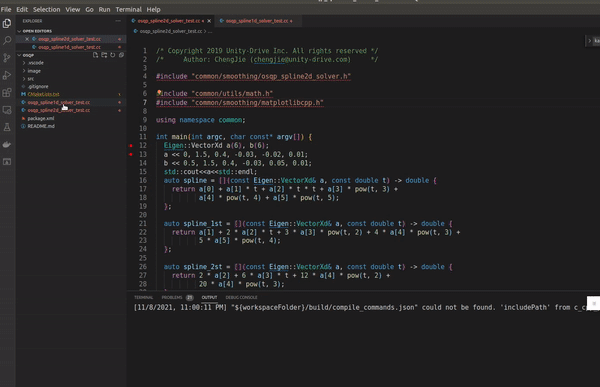

# OSQP test

主要是自己看osqp进行约束拟合所用的debug分支

更为详细的公式及代码对应的博文解释见

1. 博客园：[https://www.cnblogs.com/kin-zhang/p/15532655.html](https://www.cnblogs.com/kin-zhang/p/15532655.html)
2. CSDN：[https://blog.csdn.net/qq_39537898/article/details/121252690](https://blog.csdn.net/qq_39537898/article/details/121252690)

相关参考也列在了博客里，此处重复引用一下，绝大部分code来源于：[https://github.com/ApolloAuto/apollo/tree/master/modules/planning/math/smoothing_spline](https://github.com/ApolloAuto/apollo/tree/master/modules/planning/math/smoothing_spline)

## 使用方式

```bash
git clone https://gitee.com/kin_zhang/osqp_test.git
```

然后使用vscode内置的cmake_tool即可，比如gif所示：



或者参考：how to use cmake tool to debug, follow the youtube link: https://youtu.be/Rfj40xW9q6w

如果只想看图，可以直接

```bash
mkdir build
cd build
cmake ..
make
```

然后运行

```bash
./spile2d_test
```

便能看到这样的图形：


几点说明：红色是直接五次曲线生成的 没有添加限制，蓝色为添加了限制的osqp生成的，从图二可以看出他们的Curvature 曲率还是差距很大的，红色的曲率更小 在实际运行过程中也更好
